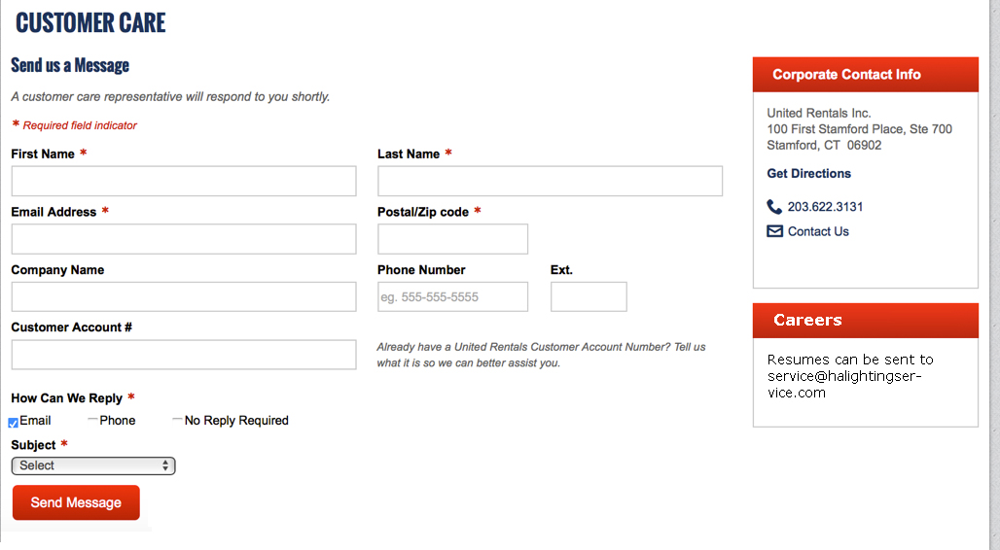
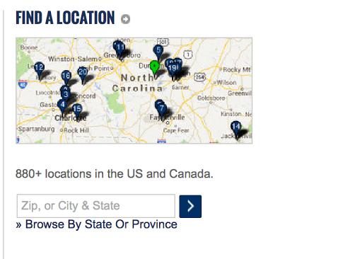

# Drupal site building
In this assignment, we will build the public-facing pages of HA Lighting.  

Note: a lesson has been posted in the da-lessons repository on Drupal site building. It contains relevant information to this assignment. It can be found here: https://github.com/debugacademy/da-lessons/blob/master/040_site_building.md

## Answering questions
For this assignment, you will be committing changes to:  
- 008_build_public_pages.md (the file you are reading)  
- Your halighting repo (you should be able to access it using the shortcut at symlinks/halighting)

**You CAN use lessons provided by the class as well as google to answer the questions, but all answers must be your own work**  

## Committing
Your commits should always be clear, concise explanations of what is being committed. They should be granular and easy to review.  

## Questions
**Create a branch based off of the master branch using the following convention:**  
** - [Topic]-[Assignment Number]-[Your initials]**  

*For example, for this assignment:*  
Ashraf Abed would create a branch named: ```ha-pages-008-aa```  

### Task 1 - Set up standard page content type
Goal: Set up the infrastructure for creating standard pages

The HA lighting website will have a number of standard, informational pages. These pages can be thought of as pieces of content of the same type. Content of the same type is created using a single 'content type', and shares the same fields.

For example:
- Each page has a Page 'Title'
- Each page has a 'Body' field, storing rich (formattable) text
- Each page can have a 'Descriptive photo' image

Let's see if we have any content types that accomplish what we are looking for.

1. Log in as admin
2. Click 'Structure'
3. Click 'Content types'

One of the content types looks promising for creating standard pages. Let's see what fields it has.

Click 'manage fields'. I see 'Title' and 'Body' fields. That covers 2/3 of the fields we said we needed.

Now, **add the image field to the content type.**

Afterwards, edit the 'Basic page' content type. Rename it to 'Standard page', and change the rest of the settings as you find appropriate.

Be sure to create standard pages for testing! Go to Content > Add content to create new content. You can always delete test pages.

### Task 2 - Determine standard pages
Now that we have the correct fields for our standard page content type, let's create our standard pages.

The public-facing pages of the website are:
- Homepage: Has a slideshow, informational text, and 3 blocks with images and text
- Careers: Has text describing careers available, and may have an image
- Maintenance: Has text describing maintenance services, and may have an image
- Projects: Has text describing project work, and may have an image
- Surveys: Has text describing surveying services, and may have an image
- Service areas: Allows searching locations for services offered by the company
- Contact us: Has a contact us form

**List the pages from the list above that can be created using the standard page content type.**
Put your answer here.

### Task 3 - Create standard pages
Create each of the standard pages by going to /node/add on your local ha.academyvm.dev website. Use the appropriate page titles, and put in sample text and a sample image.

After you are done, visit /admin/content and copy the entire list of content from that page. Paste that list here as your answer.
Place your answer here.  

### Task 4 - Create Contact Us form
The client has requested a contact us page similar to the following:


This page has a form, and 2-3 blocks with information in them.

### Task 4.1 - Create form
Research options for creating forms on Drupal.org. What is the best module for our specific use case, which is building a contact form with the fields in the picture?

### Task 4.2 - Create blocks
On your website, click 'Structure', then proceed to create your blocks.
As depicted in the image, you should create blocks for:
- Corporate contact info
- Careers

### Task 5 - Create Service Areas page
The service areas page "Allows searching locations for services offered by the company".

From the client:
"I would like something similar to the image here:



I would like a bigger map that shows the United States and Puerto Rico with pins on NC, FL and PR (the cities where the office are located with addresses. Oviedo, FL; Charlotte, NC and Bayamon, PR.  I would also like when a zip code is entered the results would show …..

Yes, (whatever city was entered) is serviced.  Maintenance Only services
Yes, (Whatever city was entered) is serviced.  Project / Survey Only services
Yes, (whatever city was entered) is serviced. Maintenance, Project, and Survey services.
No,  this area is currently not serviced."

Turning that message into requirements yeilds the following:
- They want a map with pins on it
- They want the map to be zoomed to only the US and Puerto Rico by default
- They want to be able to search locations by zip code
- They want information on which services are offered to be set on a location-by-location basis
- Searching locations by service(s) offered may also be valuable to them

We need to:
- Research options available
- Create 'locations'
- Display a map with pins for each 'location' content
- Allow searching based on zip code
- Filter the pins on the map, and return a list of content
- (optional) Allow searching based on service offered

Let's get started.

#### Task 5.1 - Determine approach
Research options for creating searchable locations by zip code (and other fields) in Drupal.

What are the top implementation options based on your research?
  - **Write answer here**

Which option do you recommend, and why?
  - **Write answer here**

#### Task 5.2 - Create structure for Location content
These locations can be thought of as pieces of content of the same type. Content of the same type is usually created using a single 'content type', and shares the same fields.

Create a location content type with the appropriate fields based on your findings in 5.1.

#### Task 5.3 - Create 'location' map
Create a map which plots location nodes on it
- Allow it to be searchable by zip code
- Make it only display the US and Puerto Rico by default

#### Task 5.4 - 'Location' text search
If not already done, ensure searching by zip code can also display results as text.

You will most likely have to create another search to do this.

#### Task 5.5 - Create Service Areas page
Create a panel page (see 'panels' and related modules).
- Place the searchable location map on the page
- Ensure results are displayed both in the map, and in text

The approach for creating the sections for this page will likely have been determined in 5.1
